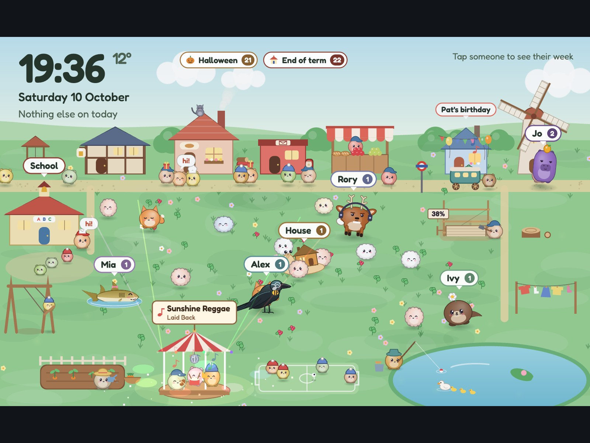

# ha-wall-panel

A Home Assistant wall dashboard for a 10 inch touch panel. We built it on an ex-corporate
Crestron TSW-1060 with no Crestron processor anywhere in the house, and everything here also
works on an ordinary wall tablet. The Crestron parts are clearly marked and you can skip them.



What you get:

- **Meadow**, the landing view. The family live in a small animated village as creatures.
  Tap one to see that person's week, pulled from your Home Assistant calendars. The kids
  walk to school, the workshop builds whatever the printer is printing, a postie delivers
  notes typed on a phone, and everyone dances when music plays.
- **Home**, the room the panel lives in. Lights, the TV, temperatures, energy, bin day.
- **Music**, Music Assistant on the wall: now playing, a speaker picker, playlist tiles
  ([screenshot](docs/img/music.jpg)).
- **Lights**, every light with a real brightness slider.
- **Printer**, a 3D printer status page (Bambu Lab A1 Mini here, easy to drop).
- **Today**, optional. A four-column family agenda with a person page behind each name. We
  retired it once the Meadow could do its job, but it still works and stays in the repo.
- **Office**, an optional example of a view that iframes a page from another server. Ours
  is private and not shipped; [06](docs/06-views.md#a-page-from-another-server) shows the
  pattern.
- A frosted glass theme over a generated wallpaper, with no scrolling anywhere at 1280x800.

On the TSW-1060 it also does the things a bare panel will not do by itself. It boots
straight into the dashboard, signs in with nobody touching it, heals itself after a power
cut, maps the capacitive side keys to views and turns its own backlight off when idle.

This repo follows a Reddit post. People asked how to build their own, so the guide is
written for a stranger starting from zero.

## What you need

- **Home Assistant**, recent. We run 2026.9. The markdown card needs `tap_action`, which
  2026.9 has.
- **A screen.** Any wall tablet with a current browser, or a Crestron TSW-1060 (the TSW-x60
  family should be close, but we have only tested the 1060).
- **HACS**, for two frontend cards:
  - [card-mod](https://github.com/thomasloven/lovelace-card-mod) (we use 4.2.1)
  - [Mushroom](https://github.com/piitaya/lovelace-mushroom), version 4 or later. The
    dashboard uses its light, media player, entity, title, template and legacy template cards.
- **Optional, for the Printer view only:** the [Bambu Lab
  integration](https://github.com/greghesp/ha-bambulab) from HACS. Delete the view if you have
  no printer.
- **Optional, for the Music view only:** [Music Assistant](https://www.music-assistant.io/)
  and its Home Assistant integration. Delete the view if you do not run it.
- **Core integrations** the views read from: Google Calendar (or any calendar integration)
  for Today and Meadow, and a `weather` entity (the default Met.no one is fine).
- **For the Crestron path only:** SSH access to the panel and Node.js on a computer, to build
  the launcher project once.

No other custom cards. Everything else is a core card: `markdown`, `clock`, `entity`,
`weather-forecast`, `picture-entity`, `iframe`, `media-control`, `grid`.

## Quick start

1. Install card-mod and Mushroom from HACS.
2. Copy `homeassistant/www/` into your Home Assistant `config/www/`, and
   `homeassistant/themes/wall-panel.yaml` into `config/themes/`.
3. Copy `homeassistant/dashboards/wall-panel.yaml` into `config/dashboards/`.
4. Merge the parts of [`configuration.example.yaml`](homeassistant/configuration.example.yaml)
   you want into your `configuration.yaml`. At minimum that is the `frontend` block and the
   `lovelace` dashboard. Read [docs/03-kiosk-login.md](docs/03-kiosk-login.md) before you add
   the `trusted_networks` provider.
5. Swap the placeholder entity ids in `wall-panel.yaml` for your own. Each view is described
   in [docs/06-views.md](docs/06-views.md).
6. Restart Home Assistant and open `/wall-panel/home` on a desktop browser to check it renders.
7. Point the tablet at `http://<your-ha-address>:8123/local/kiosk.html`. For a generic
   tablet, carry on in [docs/01-any-tablet.md](docs/01-any-tablet.md). For a TSW-1060, go to
   [docs/02-crestron-tsw1060.md](docs/02-crestron-tsw1060.md).

## Docs

| | |
|---|---|
| [01 Any tablet](docs/01-any-tablet.md) | The generic path, and which parts are Crestron-only |
| [02 Crestron TSW-1060](docs/02-crestron-tsw1060.md) | The hardware, the console, the two browsers, the launcher chain |
| [03 Kiosk login](docs/03-kiosk-login.md) | How `kiosk.html` signs in, and the security caveats |
| [04 Hard keys and backlight](docs/04-hard-keys-and-backlight.md) | Side keys, idle return, replacing standby |
| [05 Theme and glass](docs/05-theme-and-glass.md) | The glass look without blur, wallpaper, column and row maths |
| [06 Views](docs/06-views.md) | Each view, what to swap, adding people and views, the Meadow config |
| [07 Traps](docs/07-traps.md) | Twenty-four things that cost us time, so they need not cost you any |

## Layout

```
homeassistant/
  dashboards/wall-panel.yaml      the dashboard, YAML mode
  themes/wall-panel.yaml          the "Wall Panel" theme
  configuration.example.yaml      auth, frontend, dashboard, shell commands, sensors
  scripts.example.yaml
  automations.example.yaml        the webhook that opens the panel's browser
  scripts/crestron_cmd.py         runs one console command on the panel over SSH
  www/                            kiosk page, key handler, fonts, Meadow, probes
crestron/launcher/                the CH5 project the TSW-1060 boots into
tools/                            wallpaper generator, panel screenshot, console helper
docs/
```

## Credits

- [mikecirioli/crestron-ha-launcher](https://github.com/mikecirioli/crestron-ha-launcher).
  The launcher here follows its design, and its author measured the SD card wear that rules
  out EMS mode (trap 8).
- [Instrument Sans](https://fonts.google.com/specimen/Instrument+Sans) and
  [Fredoka](https://fonts.google.com/specimen/Fredoka) are bundled in `homeassistant/www/fonts/`
  under the SIL Open Font License 1.1.
- card-mod by Thomas Lovén and Mushroom by Paul Bottein do most of the visual work.

Crestron and TSW are trademarks of Crestron Electronics. This project has no connection with
Crestron.

## Licence

MIT, see [LICENSE](LICENSE). The bundled fonts keep their own licence (OFL 1.1).
