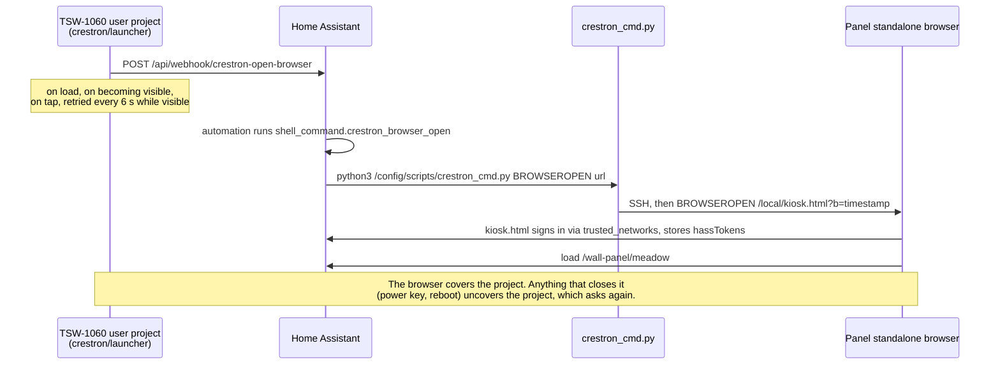

# 02 Crestron TSW-1060

The TSW-1060 is a 10.1 inch commercial touch panel meant to sit on a meeting room wall in
front of a Crestron control processor. Offices strip them out by the crate, and a used one
costs a fraction of a new tablet. Without a processor it is an Android 5.1.1 box with a
good screen, PoE power, five capacitive side keys and a console you reach over SSH. That is
enough to run Home Assistant properly, once you know where the traps are.

## The hardware

| | |
|---|---|
| Screen | 10.1 inch, 1280x800, landscape |
| Power | PoE+ (check the spec sheet for your exact model), or Crestron's power pack |
| OS underneath | Android 5.1.1 (AOSP `LMY47V`), branded "Crestron Touchpanel" |
| RAM | 1.8 GB, about 1.3 GB free at idle |
| Side keys | five capacitive keys on the right: power, home, up, bulb, down |
| Browsers | two engines, one usable ([below](#the-two-browser-engines)) |
| Firmware tested | v3.002.0036, built 20 June 2022 |

You also need a way to hang it. Check what mounting hardware comes with a used one, because
the panel is designed for Crestron's own wall and table mounts.

## Finding one

Search auction and refurb sites for "TSW-1060". The TSW-760 (7 inch) and TSW-560 (5 inch)
share the platform, but we have only tested the 1060. Look for:

- **The colour suffix** (B or W) does not matter.
- **A photo of it powered on.** A panel stuck on a boot logo may have a dead SD card
  ([trap 8](07-traps.md#8-ems-app-mode-kills-the-sd-card) is how they die).
- **Firmware.** Everything here was proved on v3.002.0036. Newer firmware may hide or change
  console commands. Check with `VER` once it is on the network.

Plan for power. A PoE+ switch port or a single-port PoE+ injector is the simple route.

## First boot and access

1. Factory reset the panel if it came out of an office, so no old project or password is
   left on it.
2. Give it a **DHCP reservation** on your router before you do anything else. The whole
   login scheme trusts its address ([03](03-kiosk-login.md)).
3. Set up an admin user on the panel if it does not already ask you to (ours did, at first
   setup). That username and password work for SSH (the console) and SFTP (the
   filesystem) on port 22.
4. `ssh <user>@<panel-ip>` and type `VER`. You are in.

Console help syntax is `COMMAND ?`, not `HELP COMMAND`. Half the commands you want are
missing from `HELP ALL` and work anyway
([trap 3](07-traps.md#3-half-the-useful-console-commands-are-hidden-from-help-all)).

## The two browser engines

This is the single most important fact about the panel. `BROWSERSELECT` switches between two
engines and they have nothing in common.

| | `CHROMIUM` (default) | `WEBVIEW` |
|---|---|---|
| Claims to be | Chrome 55 on Windows 7 | Chrome 87 on Android 5.1.1 |
| Behaves like | roughly Chrome 40 | genuinely Chrome 87 |
| Custom elements, Shadow DOM, CSS variables | no | yes |
| `Proxy`, async/await, optional chaining | no | yes |
| Service workers | yes | no |

Home Assistant needs `WEBVIEW`. On the default engine it dies before painting and the Home
Assistant logo sits there forever. That looks like an auth problem and is not one.

```
BROWSERSELECT WEBVIEW
BROWSERCACHE DISABLE
```

Both survive a reboot. Chrome 87 is old enough that Home Assistant serves it the legacy
frontend build, which is why the scripts load through `extra_js_url_es5`
([01](01-any-tablet.md#2-load-the-scripts)).

## Useful console commands

All confirmed on v3.002.0036, most of them absent from `HELP ALL`.

| Command | What it does |
|---|---|
| `VER` | firmware version |
| `BROWSERSELECT WEBVIEW` | pick the usable engine |
| `BROWSERCACHE DISABLE` | stop the browser caching to flash |
| `BROWSEROPEN <url>` | open the standalone browser at a URL, **only if it is closed** ([trap 9](07-traps.md#9-browseropen-will-not-navigate-an-open-browser)) |
| `BROWSERCLOSE` | close it |
| `BROWSERHOMEPAGE <url>` | the page it opens with no URL |
| `APPKEYS ON` | send the side keys to the app as key events |
| `STBYTO 0` | never enter standby ([04](04-hard-keys-and-backlight.md)) |
| `STANDBY`, `STANDBY OFF` | force standby and wake, for testing |
| `BRIGHTNESS <0-100>` | backlight level. Leaves auto-brightness on |
| `SCREENSHOT` | writes `/logs/ScreenShot.bmp`, 1280x800, 4 MB |
| `PROJECTLOAD` | load the user project from `/display` |
| `RAMFREE`, `CPULOAD`, `TEMPERATURE`, `UPTIME` | health |

Others exist (`PROJECTMEMORY`, `PERIODICREBOOT`, `SCREENSAVER`, `AUTOBRIGHTNESS`,
`BROWSERMOBILE`). Probe them with `COMMAND ?`.

`tools/console.exp` runs one command over SSH, and `tools/shot.sh` takes a screenshot,
fetches it over SFTP and hands back a small JPEG. Both read `PANEL_HOST`, `PANEL_USER` and
`PANEL_PASS` from the environment. The screenshot is the only instrument that tells you the
truth about layout on this panel, so use it after every change.

## Why the dashboard cannot run inside a CH5 project

A Crestron panel boots into a "user project", normally a CH5 (HTML5) app built for a
processor. It runs in that Chrome 87 engine too, so the obvious plan is to make the project
a page that loads Home Assistant.

It does not work. Inside the project webview `window.localStorage` is `null` on every
origin, including after navigating to Home Assistant's own. IndexedDB, sessionStorage and
cookies all work, but the Home Assistant frontend keeps its tokens in `localStorage` and
will not sign in without it.

The standalone browser (the one `BROWSEROPEN` starts) does have `localStorage`. So the
project's only job is to get that browser opened, and the panel cannot open it for itself.
Home Assistant has to reach back in over SSH and do it.

## The launcher chain



The pieces, in the order the panel meets them:

1. **The launcher project** ([crestron/launcher/](../crestron/launcher/)) posts the
   `crestron-open-browser` webhook on load, whenever it becomes visible, and on tap,
   retrying every six seconds until it is hidden. Edit the Home Assistant address at the top
   of its `index.html`, build it, copy the `.ch5z` to `/display` over SFTP and run
   `PROJECTLOAD`. Its README has the build commands.
2. **The automation** in [`automations.example.yaml`](../homeassistant/automations.example.yaml)
   answers the webhook (POST, local only) with `shell_command.crestron_browser_open`.
3. **The shell command** runs [`scripts/crestron_cmd.py`](../homeassistant/scripts/crestron_cmd.py),
   which uses paramiko (already inside the Home Assistant container) to SSH to the panel and
   send `BROWSEROPEN` on `kiosk.html` with a timestamp on the end to beat the month-long
   `/local/` cache. It reads the panel's address and login from
   `/config/scripts/crestron_panel.json`; copy `crestron_panel.example.json` there and fill it
   in. That file holds the panel password in plain text, so `chmod 600` it and keep it out of
   any backup you share.
4. **`kiosk.html`** signs in and hands over to the dashboard ([03](03-kiosk-login.md)).

The result heals itself. A power cut, a reboot or the power key each ends with the dashboard back on
the wall within a few seconds.

When you drive the panel by hand (`BROWSERCLOSE` then `BROWSEROPEN` somewhere else), turn the
automation off first, or the launcher will reopen the kiosk between your two commands.

## Settings to apply once

```
BROWSERSELECT WEBVIEW
BROWSERCACHE DISABLE
APPKEYS ON
STBYTO 0
```

Then copy the launcher project across and `PROJECTLOAD`. Leave `APPMODE` alone
([trap 8](07-traps.md#8-ems-app-mode-kills-the-sd-card)).

## What does not work

- **The camera.** The browser will not expose it to a page over plain HTTP
  ([trap 11](07-traps.md#11-the-camera-is-out-of-reach-of-the-browser)).
- **Catching the power key.** The firmware closes the browser on it whatever the page does.
  Home and the bulb close it too ([04](04-hard-keys-and-backlight.md)).
- **Live backdrop blur** at a usable frame rate ([05](05-theme-and-glass.md)).

## Integrations you do not need

- **Crestron Home integrations** (`ha-crestron-home` and forks) pull devices from a Crestron
  Home processor into Home Assistant. No processor, no use.
- **`home-assistant-crestron-component`** makes Home Assistant a control system over CIP and
  needs a VT Pro-e project, which is Windows-only and licensed.
- **`ch5-ha-bridge`** bridges joins and hard keys to MQTT. The keys already arrive in the
  browser as key events, so it is not needed here.
- **`crestron-ha-launcher`** is the one that fits this hardware, and the launcher here follows
  its design. Its lighter dashboard options exist for panels that cannot run the real
  frontend. The TSW-1060 on `WEBVIEW` can, so we use the real one.
