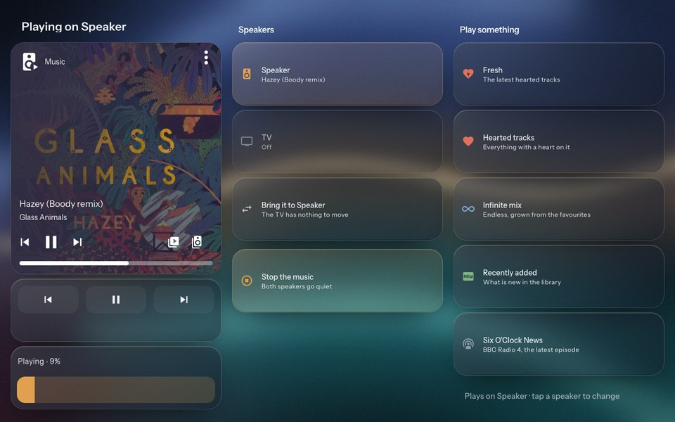

# 06 Views

The dashboard is `homeassistant/dashboards/wall-panel.yaml`, in YAML mode, at `/wall-panel/`.
Every entity id in it is a placeholder. Search the file for `light.`, `sensor.`, `switch.`,
`media_player.` and `a1mini_SERIAL` and swap in your own. The placeholder household is
Alex, Jo, Rory, Mia, Ivy, and House for shared things.

| View | Path | Side-key order |
|---|---|---|
| Meadow | `/wall-panel/meadow` | 1, the landing view |
| Today (optional) | `/wall-panel/today` | 2 |
| Home | `/wall-panel/home` | 3 |
| Music (optional) | `/wall-panel/music` | 4 |
| Lights | `/wall-panel/lights` | 5 |
| Printer (optional) | `/wall-panel/printer` | 6 |
| person pages | `/wall-panel/person-alex`, `person-mia` | subviews, from Today |
| detail pages | `detail-coming-up`, `detail-tomorrow`, `detail-school` | subviews, from Today |

Delete any optional view you do not want and take its path out of `VIEWS` in
`www/crestron-keys.js`. If you drop Music or Printer, set the matching entry in the Meadow's
`VIEW` to `null` too, or its building will try to open a view that is not there.

## Meadow


`www/meadow.html` in a full-screen `iframe` card. The family live in a small village as
creatures, alongside puffballs that wander, eat, breed and occasionally get chased by a fox.
The top left shows the time, date, outside temperature and the next thing on anyone's
calendar. Tap a creature and a card opens with that person's today and week, any school
items, kit and "heads up" flags, and a footer that says when the calendars and the school
data were last checked, or that a source could not be checked.

The scene follows the weather entity's condition (sun, cloud, rain, storm, fog, snow, wind),
goes to sleep at night, and throws a party with hats on family birthdays, Halloween, bonfire
night, Christmas and New Year's Eve. A friend's birthday on the calendar gets a smaller do
at the cottage instead.

What else happens, all of it driven by data and none of it guessed:

- **The day on a timetable.** On a school day the kids walk to the village school and back
  at school hours. A timed calendar event sends its owner to the matching place: swimming to
  the pond, football to the pitch, band, choir or scouts to the bandstand, and anything else
  out along the road to the bus stop. They set off twenty minutes early and stay an hour,
  because the calendar sensor carries no end time. All-day events move nobody. When the data
  cannot say whether it is a school day, nobody goes.
- **The printer workshop.** With a Bambu Lab printer, the workshop plot goes from bare earth
  to scaffold, walls, roof and sign as the print's progress rises, with a builder hammering
  and the percentage on the fence. Pause sits him down, a failed print knocks it flat, and a
  finished one rings a bell. A reading older than six minutes empties the plot, so a stale
  45% never keeps anyone hammering.
- **The postie.** Type `Ivy: tea's at six` into `input_text.meadow_letter`, or run the
  `meadow_send_letter` script from `scripts.example.yaml` on a phone. The postie carries it to
  that person, who wears the letter above their tag until someone opens their card. Opening
  the card shows it and clears the helper. A name the meadow does not know goes to House.
- **The kit bag.** When the kit sensor names kit for today, a bag sits by the cottage door
  before school.
- **Countdowns** in the sky: birthdays and the fixed days in `DATES`, Easter, the end of term
  from `sensor.family_extra`, and holidays. Any event on the `trips` calendar with "holiday"
  in its title becomes a countdown, so "Holiday Cornwall" shows as Cornwall.
- **Rain.** The weather entity (met.no by default) picks the scene. An optional rain sensor
  adds rain the forecast misses. It never takes rain away.
- **Music.** While the speaker plays music the family dance, and the bandstand puts on a
  light show with a sign on its roof that shows what is playing. Podcasts and audiobooks do
  not count.
- **Buildings are shortcuts.** Tap the cottage for Home, the bandstand for Music, the
  workshop for Printer. See `VIEW` below.
- **The office robot.** Off unless `OFFICE_URL` is set. A small robot wanders the meadow
  saying the latest line from an agent office (see [the Office
  example](#an-example-our-office)).

It reads Home Assistant itself, over the REST API, with the `hassTokens` the kiosk page
stored ([03](03-kiosk-login.md)). Only `sensor.family_week` is required. Every other entity
is optional, and setting it to `null` in `SENSORS` turns off that part of the meadow and
nothing else. A sensor that is set but unavailable blanks its own part and says so in the
corner.

**Try it without Home Assistant.** Open `meadow.html` straight from disk, or add `?demo`,
and it runs on built-in demo data. Test hooks:

| Hook | Does |
|---|---|
| `?demo` | built-in demo data, no Home Assistant needed |
| `?hour=21.5` | fakes the clock |
| `?date=2026-12-24` | fakes the day, for countdowns, parties and school days. Pair it with `?hour=` |
| `?weather=snow` | forces the weather: sunny, partly, cloudy, rain, storm, fog, snow, windy |
| `?open=Mia` | opens a card |
| `?party=christmas` | starts a party. A name from `PEOPLE` works too, or `friend:Pat` for a house party |
| `?printer=running:45` | fakes the printer: `running:N`, `pause:N`, `prepare`, `finish`, `failed`, `idle`, `offline` |
| `?letter=Ivy:hello` | delivers a letter a few seconds after boot (URL-encode it) |
| `?music=on` | the speaker is playing. `?mtitle=` and `?martist=` set the sign's text |
| `?office=quiet` | fakes the office robot: `off`, `quiet`, `ask:Name`, or `Name:what it is doing` |
| `?fps` | frame rate and per-frame JavaScript time, bottom right |

### The CONFIG block

Everything you should need to change sits at the top of the script.

**`PEOPLE`**, one entry per creature:

```js
{ name: "Alex", col: "#7FC8D2", r: 37, look: "crow", tg: 2.25, adult: true, glasses: true }
```

- `name` must match the `who` values the sensors produce. Those come from the calendar
  owner map in `configuration.example.yaml`, so change both together.
- `col` is the person's colour, used for the creature, the name tag and the card.
- `look` is the animal. The rigged, part-animated looks are `crow`, `capybara`, `shark`,
  `deer`, `otter` and `snail`. The older whole-sprite looks are `bear`, `bunny`, `phones`,
  `curls` and `flower`.
- Accessories are flags worn whatever the animal: `glasses`, `phones` (headphones),
  `daisy`. `adult: true` gives neater ears and a taller body. The comment above `PEOPLE`
  has the current list.
- `r` is body size in pixels. `tg` is how far above the feet the name tag sits, in body
  radii. If you change someone's look and the tag lands on their head, adjust `tg`.
- **Aliases** are the other names a person goes by in calendar titles, so "Mum's birthday"
  or a nickname still finds the right creature for the party hat.
- `school: true` counts this person's items on the School tag and card, and sends them to
  school on school days.
- `bee: true` has a bee circle this one. One person only.
- The last entry, House, is the household: bin day, the window cleaner, anything nobody owns.

**`ANNIVERSARY`** names the two people who get a party on a calendar event titled
"Anniversary".

**`SENSORS`** lists the entities. `week` is required. Every other one is optional, and
`null` switches its part off:

| Key | Example | Drives |
|---|---|---|
| `week` | `sensor.family_week` | everything, required |
| `extra` | `sensor.family_extra` | school items, kit, flags, term dates, "couldn't check" |
| `timetable`, `kit`, `lunch` | `sensor.mia_school_week` | per-child school sensors on the School card. `kit` also puts out the kit bag |
| `sun`, `weather` | `sun.sun`, `weather.forecast_home` | how dark it is, and the scene's weather |
| `printer` | `"sensor.a1mini_SERIAL_"` | the workshop. This one is a prefix, not an entity: the meadow appends `print_status`, `print_progress` and so on. `null` by default |
| `letter` | `input_text.meadow_letter` | the postie |
| `music` | `media_player.music` | dancing and the bandstand show |
| `rain` | `sensor.rain_sensor` | extra rain on top of the forecast. `null` by default |
| `trips` | `calendar.family` | holiday countdowns |

**`SCHOOL_WHO`** says whose card each per-child school sensor belongs to, for example
`{ timetable: "Mia", kit: "Ivy", lunch: "Ivy" }`.

**`SOURCE_OWNER`** maps source names in `family-extra.json` to people, as pairs of a regular
expression and a name:

```js
var SOURCE_OWNER = [[/primary/, "Ivy"], [/jo-mail/, "Jo"]];
```

When a source lands in `sources.unavailable`, the matching person's card says "Couldn't check:
…" instead of showing an empty week as if it were a quiet one. House sees every missing
source.

**`SCHOOL_LINE`** is the order the kids queue at the school door, front to back. Put the
highest name tag (largest `tg`) first so the tags fan out instead of overlapping.

**`RAIN_STATES`** says which of the rain sensor's states mean wet and which mean dry. The
defaults cover `raining`/`none`, `wet`/`dry` and a binary sensor's `on`/`off`. Any other state
counts as no reading, and the console says so.

**`DATES`** holds the countdowns. `birthdays` maps names from `PEOPLE` to `"MM-DD"`, and
each one throws that person's party on the day. `fixed` is the list of days that work for
anyone (Halloween, bonfire night, Christmas, New Year's Eve). Holidays need no entry here,
they come from the `trips` calendar.

**`VIEW`** maps buildings to dashboard views:

```js
var VIEW = { home: "/wall-panel/home", music: "/wall-panel/music", printer: "/wall-panel/printer", office: null };
```

`null` leaves that building as scenery. How the tap reaches the dashboard is in
[04](04-hard-keys-and-backlight.md#the-meadows-buildings).

**`OFFICE_URL`** is the address the office robot polls. `null`, the default, keeps the robot
out of the meadow entirely. If you run something like it, the URL must answer `GET` with
JSON shaped `{ <source>: { data: { title, stations: [{ id, state, detail, attention }] } } }`
and send CORS headers that allow Home Assistant's origin. The comment above `OFFICE` in
`meadow.html` says what the robot makes of each state. It never invents a line: no bubble
unless the server said it in the last 45 seconds.

Bump `?v=` on the iframe URL in the dashboard after every edit.

## Today (optional)

We retired Today on our own panel once the Meadow covered the same ground. It still works
and stays in the repo, second in `VIEWS`, for anyone who wants a plain agenda.
Delete it and its subviews together if the Meadow is enough.

A four-column family agenda. The first column is ambient: a 92px clock, the forecast, "Coming
up" (the next three timed events across everyone) and a few temperatures. Then one glass
panel per person in their own colour, with today's events, and a House panel for shared
calendars. Tomorrow and School cards open their own detail pages.

Each person panel is one markdown card with a `title:` and a `tap_action` that opens their
subview. The repo ships two example person pages, `person-alex` and `person-mia`, and three
detail pages behind Coming up, Tomorrow and School. Copy a person page for everyone else.

Subviews route fine on the TSW-1060 but their back arrow never appears, so each carries its
own back card, and the Home key is the other way out.

The detail pages alias YAML anchors defined in the first person page, so **they must stay
after the person pages in the file**
([trap 17](07-traps.md#17-a-yaml-alias-cannot-precede-its-anchor-so-subview-order-matters)).

## Home

The room the panel lives in. Left, the time, date, forecast, two temperatures and
yesterday's energy costs. Middle, the lights in this room with a permanent brightness slider
on the main one, and the TV with power and mute. Right, the kitchen lights as tiles, then
the rest of the house as a flat list. One amber "Lights off" button turns off every light
in the house.

Glass cards are the things you touch often. Flat cards are reference.

Swap: the light entities, `media_player.living_room_tv`, the two temperature sensors, the
four `sensor.energy_*` entities (or delete those two cards), and `weather.forecast_home`.

**Half-width tiles.** The living room and kitchen pairs and the "Around the house" list sit
two to a row (`grid_options: { columns: 6 }`), because eight full-width rows plus Lights off
come to more than 800px. Lights does the same. A half tile clips its name at about eleven
characters, so give those lights short names in the card's `name:`, such as "Back" or
"Hall", rather than living with "Living room…".

**Bin day, optional.** The left column has a bin tile that reads `sensor.bin_collections`.
We ship no script for it, because every council publishes collections differently. Write
whatever fills a sensor of this shape. The `command_line` entry in
`configuration.example.yaml` runs your script and reads the JSON it prints:

| Field | Contents |
|---|---|
| state | days to the next collection, `0` for today, `unknown` when no date is known |
| `next_short` | short names of what goes out next, such as `["Black bin", "Food"]` |
| `next_date` | the next collection, `YYYY-MM-DD` |
| `bins` | every bin, as `{ name, short, next }` |
| `fetch`, `error`, `checked_at` | whether the last lookup worked, and when |

The tile says "Bins out today", "tomorrow" or "in N days" with the list underneath, turns
amber a day ahead, and says "Bins: no data" rather than going blank. No sensor? Delete the
card.


## Music (optional)

[Music Assistant](https://www.music-assistant.io/) on the wall. Three columns of twelve rows:
what is playing (art, title, a progress bar and wall-sized transport buttons), the speakers,
and the things the family actually tap. Nothing is conditional and nothing changes height,
so idle states are written into the templates.



**One entity for every card.** No Lovelace card can template its entity, and a pair of
conditional cards would cost grid rows ([trap
15](07-traps.md#15-a-hidden-conditional-card-still-reserves-its-grid-rows)). So every card
reads `media_player.music`, a `universal` media player in `configuration.example.yaml`
whose active child follows `input_select.music_target`. Its album art comes through Home
Assistant's own media proxy, on the panel's origin, instead of from the Music Assistant
add-on's port. The core `media-control` card and Mushroom's media player cards work on it
unchanged.

- **The speaker picker.** Two tiles, Speaker and TV, set `input_select.music_target`. The
  chosen one is tinted amber and the other dims. A line at the bottom of the right column
  says where a tap will land.
- **Bring it here.** Calls `script.music_bring_here`, which moves whatever the other player
  is playing onto the chosen one with `music_assistant.transfer_queue` and carries on. It
  does nothing when the other player is silent, and the tile says so before you tap.
- **Quick starts.** Playlist and radio tiles call `script.music_play` with a Music
  Assistant URI such as `library://playlist/1`. The script picks the real player from
  `input_select.music_target` and replaces the queue, so a tap always gets what it asked
  for. Find your own ids with the `music_assistant.get_library` action. `library://playlist/N`
  stays stable until the playlist is deleted.
- **The latest episode, optional.** The news tile plays the newest episode of a podcast.
  Music Assistant would start from the oldest unplayed one
  ([trap 23](07-traps.md#23-music-assistant-starts-a-podcast-from-the-oldest-unplayed-episode)),
  so a REST sensor reads the feed and picks the newest enclosure by date, and the tile passes
  it as `latest_from`. If the feed is down, the script falls back to the tile's `media_id`.
  No podcast? Delete the tile and the sensor.

Swap: `media_player.kitchen_speaker` and `media_player.living_room_tv_music` for your two
Music Assistant players, in `configuration.example.yaml`, `scripts.example.yaml` and the
view, and the playlist ids. With one player, point the universal player straight at it and
delete the picker and Bring it here. Music Assistant's own services refuse the universal
entity ([trap 22](07-traps.md#22-music-assistant-refuses-a-universal-media-player)), which
is why the tiles go through scripts.

The Meadow reads the same `media_player.music`, so the family dance to whatever this view
starts.

## Lights

Every light with a real brightness slider, grouped by room. The bulb key opens it. Swap the
light entities.


## Printer

Three columns of exactly twelve rows. The print (a big percentage, progress bar, time left,
finish time, pause/resume, chamber light), what it is making (camera still, job, setup), and
the machine (nozzle, bed, fans, the four AMS slots and the external spool, a health line).

Built for a Bambu Lab A1 Mini through the HACS Bambu Lab integration, which names entities
`…a1mini_<serial>_…`. Replace `a1mini_SERIAL` with your printer's prefix. Pause and resume
are one tile that calls `script.printer_pause_resume` from `scripts.example.yaml`, which
branches on the print status
([trap 15](07-traps.md#15-a-hidden-conditional-card-still-reserves-its-grid-rows) explains
why it is a script).

No printer? Delete the view and remove its path from `VIEWS`.


## Adding a person

1. Add their calendar(s) to the `calendar.get_events` target lists and the owner map in
   the `family_today` and `family_week` template sensors in `configuration.example.yaml`.
2. Add a panel for them on Today, and copy a person page for them.
3. Add them to `PEOPLE` in `meadow.html`, and to `DATES.birthdays`. A school-age child
   goes in `SCHOOL_LINE` too, and in the recipient list of `meadow_send_letter`.
4. Restart Home Assistant. A template reload leaves a new trigger-based template sensor
   with no attributes until something fires its triggers, which looks like a broken template.

## Adding a view

1. Add the view to `wall-panel.yaml`. Keep it visible. The frontend will not route to a view
   with `visible: false`
   ([trap 10](07-traps.md#10-hidden-dashboard-views-are-not-routable)), and the theme hides
   the tab bar anyway.
2. Add its path to `VIEWS` in `www/crestron-keys.js`, in the order you want the up and down
   keys to pan.
3. Bump `?v=` for `crestron-keys.js` in the `frontend` block.

Home Assistant re-reads a YAML dashboard when a client asks it to (the Refresh item in the
dashboard's menu on a desktop browser does this, and reports a YAML error if there is one).
Then reload the panel. On the TSW-1060, close the browser from the console and let the
launcher reopen it.

### A page from another server

Any web page can be a view: a `panel` view holding one full-screen `iframe` card, the way the
Meadow is built.

```yaml
  - title: Office
    path: office
    type: panel
    theme: Wall Panel
    cards:
      - type: iframe
        url: http://192.168.1.60:8137/
```

Two things change when the page lives on another server instead of under `/local/`.

**The side keys and taps stop reaching the dashboard.** The Meadow is on Home Assistant's
origin, so it dispatches its key presses and taps straight onto the dashboard document
([04](04-hard-keys-and-backlight.md#idle-return)). A page from another origin cannot touch
that document ([trap
21](07-traps.md#21-a-cross-origin-iframe-cannot-dispatch-events-on-the-dashboard)). It has
to post them up instead, and `crestron-keys.js` relays them. Set `EMBED_ORIGIN` near the
bottom of `crestron-keys.js` to the page's exact origin, scheme and port included, and bump
`?v=`. It is `null` by default, which keeps the relay off, and the handler ignores messages
from every other origin. Then add this to the embedded page:

```js
if (window.parent !== window) {
  var HA = "http://192.168.1.20:8123";   // your Home Assistant's origin, exactly
  ["keydown", "keyup", "keypress"].forEach(function (type) {
    document.addEventListener(type, function (e) {
      window.parent.postMessage({ type: "crestron-key", event: type, key: e.key, code: e.code }, HA);
    }, true);
  });
  document.addEventListener("pointerdown", function () {
    window.parent.postMessage({ type: "crestron-activity" }, HA);
  }, true);
}
```

Without the activity message the idle timer sends the panel back to the Meadow after five
minutes, however busy someone is in the embedded page.

**Mixed content.** If you reach Home Assistant over HTTPS, the browser blocks an `http://`
iframe on that page without saying much. Serve the embedded page over HTTPS too, or keep the
panel on plain HTTP like ours.

Add the path to `VIEWS` as usual. To make a Meadow building open it, set the matching entry
in `VIEW`.

### An example: our office

On our panel an Office view sits after Printer. It is a live pixel-art office showing the
Claude Code sessions running on the author's computer, served by a small Node server of his
own, which also feeds the Meadow's office robot through `OFFICE_URL`. Neither is published,
because both are wired to one person's machine, so treat it as the pattern above in use and
not something to install. That is also why `VIEW.office` and `OFFICE_URL` ship as `null`.

## Where the family data comes from

**Calendars.** Home Assistant's own calendar integration does the work. The two template
sensors call `calendar.get_events` on a timer and flatten every event into a list:

```json
{ "who": "Mia", "what": "Swimming", "day": "2026-09-21", "all_day": false,
  "start": "2026-09-21T17:00:00+01:00", "at": "17:00" }
```

- `sensor.family_today` covers today, every five minutes.
- `sensor.family_week` covers seven days, every 15 minutes, plus `checked_at`.

`who` comes from an owner map from calendar entity to person, with `House` as the default.
Keep the fields lean. The recorder drops attributes over about 16KB, and many calendars
over seven days gets there.

**Everything calendars cannot hold.** School items, kit days, term dates. The
`family_extra` `command_line` sensor reads a JSON file every five minutes and exposes its
keys as attributes. The shape is documented by
[`www/family-extra.example.json`](../homeassistant/www/family-extra.example.json):

| Key | Contents |
|---|---|
| `checked_at` | when the data was gathered, ISO 8601 |
| `sources.ok`, `sources.unavailable` | which sources were and were not checked |
| `needs_human` | a count of things someone should look at |
| `items` | dated entries, `who`, `date`, `kind`, `what` |
| `kit` | standing weekly reminders, `who`, `what` |
| `flags` | free-text warnings, shown on House |
| `schools` | per child, term dates and closure days |

We fill ours with a private script that reads school websites and email. How you fill it is
up to you: by hand, a script, an automation. Keep `checked_at` honest, and list a source
under `unavailable` when you could not check it, so the panel says so instead of showing a
confident blank.

The example config reads the file from `/config/www/`. **Anything there is public**, so move
real data out of `www/` first ([03](03-kiosk-login.md#security)).
