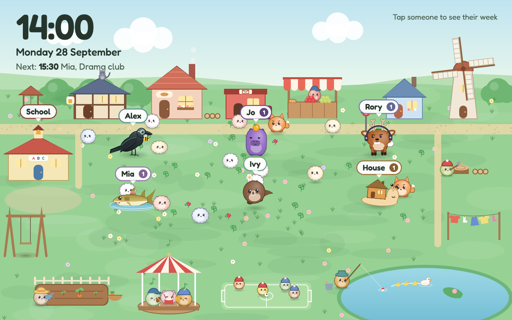
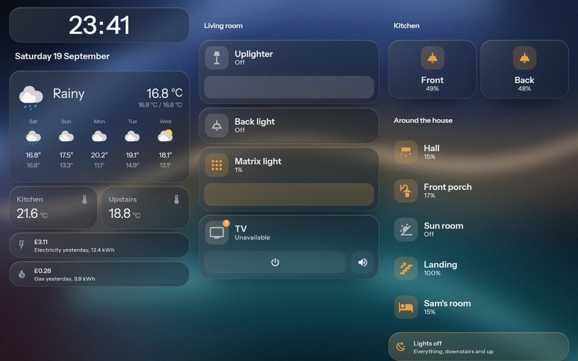
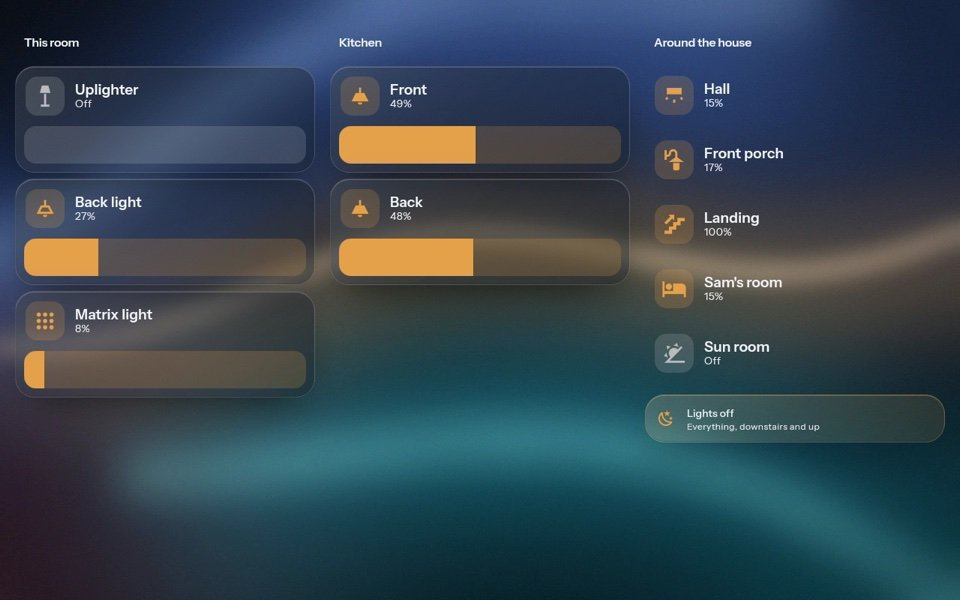
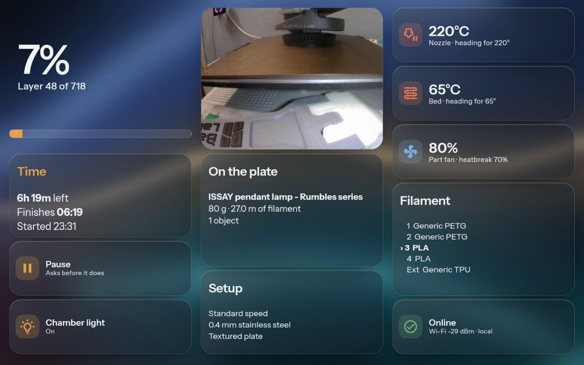

# 06 Views

The dashboard is `homeassistant/dashboards/wall-panel.yaml`, in YAML mode, at `/wall-panel/`.
Every entity id in it is a placeholder. Search the file for `light.`, `sensor.`, `switch.`,
`media_player.` and `a1mini_SERIAL` and swap in your own. The placeholder household is
Alex, Jo, Rory, Mia, Ivy, and House for shared things.

| View | Path | Side-key order |
|---|---|---|
| Meadow | `/wall-panel/meadow` | 1, the landing view |
| Today | `/wall-panel/today` | 2 |
| Home | `/wall-panel/home` | 3 |
| Lights | `/wall-panel/lights` | 4 |
| Printer | `/wall-panel/printer` | 5 |
| person pages | `/wall-panel/person-alex`, `person-mia` | subviews, from Today |
| detail pages | `detail-coming-up`, `detail-tomorrow`, `detail-school` | subviews, from Today |

## Meadow



`www/meadow.html` in a full-screen `iframe` card. The family live in a small village as
creatures, alongside puffballs that wander, eat, breed and occasionally get chased by a fox.
The top left shows the time, date, outside temperature and the next thing on anyone's
calendar. Tap a creature and a card opens with that person's today and week, any school
items, kit and "heads up" flags, and a footer that says when the calendars and the school
data were last checked, or that a source could not be checked.

The scene follows the weather entity's condition (sun, cloud, rain, storm, fog, snow, wind),
goes to sleep between 20:30 and 06:30, and throws a party with hats on family birthdays,
Halloween, bonfire night, Christmas and New Year's Eve.

It reads Home Assistant itself, over the REST API, with the `hassTokens` the kiosk page
stored ([03](03-kiosk-login.md)):

- `sensor.family_week`, required;
- `sensor.family_extra`, for school items;
- `weather.forecast_home` and `sun.sun`, optional;
- a few optional per-child school sensors. A missing one blanks its part of the card and
  nothing else.

**Try it without Home Assistant.** Open `meadow.html` straight from disk, or add `?demo`,
and it runs on built-in demo data. Test hooks for the look: `?hour=21.5` fakes the clock,
`?weather=snow` forces the weather, `?open=Mia` opens a card, `?party=christmas` (or a
person's name) starts a party.

### The CONFIG block

Everything you should need to change sits at the top of the script.

**`PEOPLE`**, one entry per creature:

```js
{ name: "Alex", col: "#7FC8D2", r: 37, look: "crow", tg: 2.25, adult: true, glasses: true }
```

- `name` must match the `who` values the sensors produce. Those come from the calendar
  owner map in `configuration.example.yaml`, so change both together.
- `col` is the person's colour, used for the creature, the name tag and the card.
- `look` is the animal. The rigged, part-animated looks are `crow`, `capybara`, `shark`,
  `deer`, `otter` and `snail`. The older whole-sprite looks are `bear`, `bunny`, `phones`,
  `curls` and `flower`.
- Accessories are flags worn whatever the animal: `glasses`, `phones` (headphones),
  `daisy`. `adult: true` gives neater ears and a taller body. The comment above `PEOPLE`
  has the current list.
- `r` is body size in pixels. `tg` is how far above the feet the name tag sits, in body
  radii. If you change someone's look and the tag lands on their head, adjust `tg`.
- **Aliases** are the other names a person goes by in calendar titles, so "Mum's birthday"
  or a nickname still finds the right creature for the party hat.

**`SOURCE_OWNER`** maps source names in `family-extra.json` to people, as pairs of a regular
expression and a name:

```js
var SOURCE_OWNER = [[/example-primary/, "Ivy"], [/second-mailbox/, "Jo"]];
```

When a source lands in `sources.unavailable`, the matching person's card says "Couldn't check:
…" instead of showing an empty week as if it were a quiet one. House sees every missing
source.

Bump `?v=` on the iframe URL in the dashboard after every edit.

## Today

A four-column family agenda. The first column is ambient: a 92px clock, the forecast, "Coming
up" (the next three timed events across everyone) and a few temperatures. Then one glass
panel per person in their own colour, with today's events, and a House panel for shared
calendars. Tomorrow and School cards open their own detail pages.

Each person panel is one markdown card with a `title:` and a `tap_action` that opens their
subview. The repo ships two example person pages, `person-alex` and `person-mia`, and three
detail pages behind Coming up, Tomorrow and School. Copy a person page for everyone else.

Subviews route fine on the TSW-1060 but their back arrow never appears, so each carries its
own back card, and the Home key is the other way out.

The detail pages alias YAML anchors defined in the first person page, so **they must stay
after the person pages in the file**
([trap 17](07-traps.md#17-a-yaml-alias-cannot-precede-its-anchor-so-subview-order-matters)).

## Home

The room the panel lives in. Left, the time, date, forecast, two temperatures and
yesterday's energy costs. Middle, the lights in this room with a permanent brightness slider
on the main one, and the TV with power and mute. Right, the kitchen lights as tiles, then
the rest of the house as a flat list. One amber "Lights off" button turns off every light
in the house.

Glass cards are the things you touch often. Flat cards are reference.

Swap: the light entities, `media_player.living_room_tv`, the two temperature sensors, the
four `sensor.energy_*` entities (or delete those two cards), and `weather.forecast_home`.



## Lights

Every light with a real brightness slider, grouped by room. The bulb key opens it. Swap the
light entities.



## Printer

Three columns of exactly twelve rows. The print (a big percentage, progress bar, time left,
finish time, pause/resume, chamber light), what it is making (camera still, job, setup), and
the machine (nozzle, bed, fans, the four AMS slots and the external spool, a health line).

Built for a Bambu Lab A1 Mini through the HACS Bambu Lab integration, which names entities
`…a1mini_<serial>_…`. Replace `a1mini_SERIAL` with your printer's prefix. Pause and resume
are one tile that calls `script.printer_pause_resume` from `scripts.example.yaml`, which
branches on the print status
([trap 15](07-traps.md#15-a-hidden-conditional-card-still-reserves-its-grid-rows) explains
why it is a script).

No printer? Delete the view and remove its path from `VIEWS`.



## Adding a person

1. Add their calendar(s) to the `calendar.get_events` target lists and the owner map in
   the `family_today` and `family_week` template sensors in `configuration.example.yaml`.
2. Add a panel for them on Today, and copy a person page for them.
3. Add them to `PEOPLE` in `meadow.html`.
4. Restart Home Assistant. A template reload leaves a new trigger-based template sensor
   with no attributes until something fires its triggers, which looks like a broken template.

## Adding a view

1. Add the view to `wall-panel.yaml`. Keep it visible. The frontend will not route to a view
   with `visible: false`
   ([trap 10](07-traps.md#10-hidden-dashboard-views-are-not-routable)), and the theme hides
   the tab bar anyway.
2. Add its path to `VIEWS` in `www/crestron-keys.js`, in the order you want the up and down
   keys to pan.
3. Bump `?v=` for `crestron-keys.js` in the `frontend` block.

Home Assistant re-reads a YAML dashboard when a client asks it to (the Refresh item in the
dashboard's menu on a desktop browser does this, and reports a YAML error if there is one).
Then reload the panel. On the TSW-1060, close the browser from the console and let the
launcher reopen it.

## Where the family data comes from

**Calendars.** Home Assistant's own calendar integration does the work. The two template
sensors call `calendar.get_events` on a timer and flatten every event into a list:

```json
{ "who": "Mia", "what": "Swimming", "day": "2026-09-21", "all_day": false,
  "start": "2026-09-21T17:00:00+01:00", "at": "17:00" }
```

- `sensor.family_today` covers today, every five minutes.
- `sensor.family_week` covers seven days, every 15 minutes, plus `checked_at`.

`who` comes from an owner map from calendar entity to person, with `House` as the default.
Keep the fields lean. The recorder drops attributes over about 16KB, and many calendars
over seven days gets there.

**Everything calendars cannot hold.** School items, kit days, term dates. The
`family_extra` `command_line` sensor reads a JSON file every five minutes and exposes its
keys as attributes. The shape is documented by
[`www/family-extra.example.json`](../homeassistant/www/family-extra.example.json):

| Key | Contents |
|---|---|
| `checked_at` | when the data was gathered, ISO 8601 |
| `sources.ok`, `sources.unavailable` | which sources were and were not checked |
| `needs_human` | a count of things someone should look at |
| `items` | dated entries, `who`, `date`, `kind`, `what` |
| `kit` | standing weekly reminders, `who`, `what` |
| `flags` | free-text warnings, shown on House |
| `schools` | per child, term dates and closure days |

We fill ours with a private script that reads school websites and email. How you fill it is
up to you: by hand, a script, an automation. Keep `checked_at` honest, and list a source
under `unavailable` when you could not check it, so the panel says so instead of showing a
confident blank.

The example config reads the file from `/config/www/`. **Anything there is public**, so move
real data out of `www/` first ([03](03-kiosk-login.md#security)).
